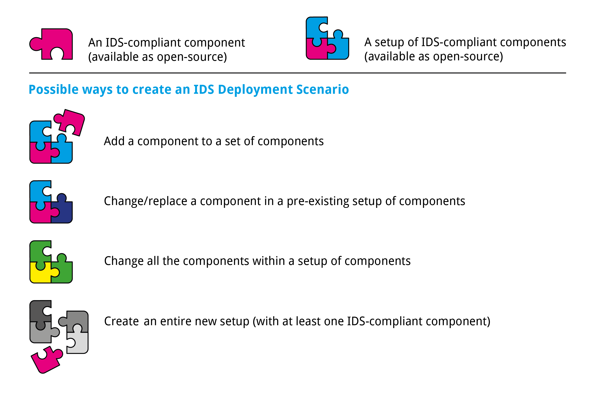
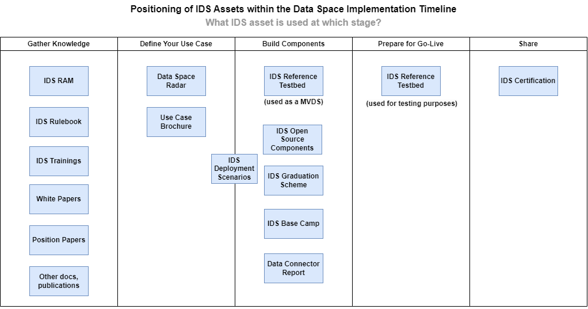
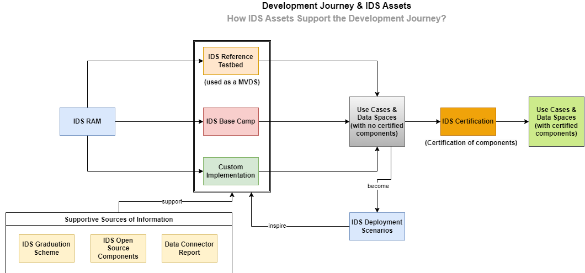

# IDS Testbed and Deployment Scenarios Report

## 1. Introduction

### 1.1 What is a Data Space?

A data space is a secure and standardized digital infrastructure that enables trusted data exchange and data-based services among various stakeholders. In the IDS definition, a data space is a virtual space that provides a standardized framework for data exchange, based on common protocols and formats, as well as secure and trusted data sharing mechanisms. The IDS data space is designed to support data sovereignty, meaning that data owners retain control over their data and can determine who can use it and under what conditions. This is called Data Sovereignty.

The IDS data space is intended to support a wide range of applications and industries. The data space is designed to be interoperable with other data spaces, enabling seamless data exchange across different domains and industries. Overall, the IDS data space is a flexible and scalable domain and technology-agnostic framework that enables secure and trusted data exchange and services, while preserving data sovereignty and privacy.

### 1.2 What are cool use cases and why do we need data spaces?

Based on the [IDS-RAM](https://docs.internationaldataspaces.org/ids-ram-4/), Dataspaces enable cross-company business processes known as use cases. These use cases play a crucial role in identifying, analyzing, and evaluating user requirements for IDS. Moreover, by implementing a use case, companies can foster innovation and create an ecosystem by involving internal and external stakeholders in the development of smart value-added services. Use cases serve as the fuel for data spaces, which act as the engine. They facilitate and expedite the creation of cross-domain and cross-country data spaces with numerous participants.

The [Data Spaces Overview](https://internationaldataspaces.org/wp-content/uploads/dlm_uploads/Data_Spaces_Radar_Web_230307.pdf) brochure, which is available via [Most Important Documents](https://internationaldataspaces.org/publications/most-important-documents/) page of IDSA Website lists the use cases along with the challenges they are tackling, the success stories behind and the components used in each scenario to enable data sharing in a secure and sovereign way. This document gets updated on an annual basis.

All listed use cases address the need for sharing data while maintaing data sovereigtny. While the Data Spaces Overview provides an overview on the business related needs, this report shall investigate the technical aspects of those soltutions to interoperability and data sovereigtny.

### 1.3 Technically speaking, what is a data space?

A data space is the environment where data from different sources can be collected, processed, and shared in a secure and sovereign fashion. A data space allows exchange and processing of data between different organizations, systems, and applications.

As depicted simply on the infographic above, IDS-compliant data space consists of mandatory and optional components such as IDS Connectors, Identity Provider, Meta-Data-Broker, App Store, Clearing House, and Vocabulary Provider. These could also be considered as roles that are must-have in a data space. All these components and their roles in a IDS-compliant data space, are provided in more detail within [IDS Reference Architecture Model](https://docs.internationaldataspaces.org/ids-ram-4/).

The compliance to the rules, concepts and specification of the [Reference Architecture Model](https://docs.internationaldataspaces.org/ids-ram-4/), is verified against the [IDS-Reference-Testbed](#21-ids-reference-testbed) and subject to Certification. The [IDSA Rulebook](https://docs.internationaldataspaces.org/idsa-rulebook-v2/) discusses the functional requirements of IDS Dataspaces. Those artifacts are subject of the [IDSA Magic Triangle](https://docs.internationaldataspaces.org/ids-ram-4/introduction/1_1_goals_of_the_international_data_spaces/1_3_relation_to_other_assets).

### 1.4 Connectors

Dataspace Connectors are the tool for each participant in a Dataspace to exchange and share data. They enable technical and semantical interoperability and put the data subject in the control of the data usage in the means of access to and usage of data. As different Dataspaces have different requirments, each organization and use case have different requirements. Given that, different Dataspace Connector implementations evolved and will evolve.

To address this evolving landscape of Dataspace Connectors, the [Data Connector Report](https://internationaldataspaces.org/data-connector-report/) offers a comprehensive documentation of all currently existing data connector implementations, providing valuable insights into their present state of development and usage.

### 1.5 Relationship between Data Connector Report and IDS Deployment Scenarios**

The relationship between [Data Connector Report](https://internationaldataspaces.org/data-connector-report/) can be used as a reference and a starting point for IDS Deployment Scenarios. For example, if a deployment scenario requires a data connector, the report can be consulted to determine which data connector implementation to use based on its present state of development and usage. Similarly, the deployment scenario can provide valuable feedback on the usage of the data connector, helping to inform future updates and improvements to the Data Connector Report.

Data Connector Report and IDS Deployment Scenarios are complementary resources that support the development and implementation of the IDS standard. The report provides a comprehensive overview of data connector implementations, while deployment scenarios outline the steps and processes involved in delivering IDS components to end-users. Together, these resources help ensure the consistency, efficiency and applicability of IDS standard to tackle challenges related to secure and sovereign data exchange. Another source that could be consulted would be [IDS Graduation Scheme](https://github.com/International-Data-Spaces-Association/idsa/tree/main/graduation_scheme) listing the [projects](https://github.com/International-Data-Spaces-Association/idsa/blob/main/graduation_scheme/Projects.md) (either as sole components or set of components) that have an adequate level of maturity.

### 1.6 Minimum Viable Data Spaces: what are the services we need?

A Minimum Viable Data Space (MVDS) is a combination of components that enable the creation of a data space with just enough features to be usable for secure and sovereign data exchange, as specified by the International Data Spaces Association (IDSA). The goal of an MVDS is to streamline the implementation process, making it easier and faster for experimenters to create a working data space with secure and sovereign data exchange. By starting with an MVDS, the development team can iterate quickly and respond to the requirements of the data space, making adjustments as necessary to meet the needs of users.

The IDSA Head Office provides the MVDS as a best practice for creating data spaces. At a minimum, an MVDS includes:

- Two connectors (one acting as a data provider, and one as a data consumer)
- An identity provider (Dynamic Attribute Provisioning Service, Certificate Authority)
- Optional and additional components, such as a metadata broker, an app store, a clearing house, or a vocabulary provider, can be added to the MVDS to extend its functionality and enable more advanced features, such as searching for data sets. The MVDS provides a starting point for experimenters to create a functional data space that can be customized and expanded as needed to meet specific requirements.

## 2. Foundation - Terms and Definitions

[IDS Glossary](https://github.com/International-Data-Spaces-Association/IDS-G/tree/main/Glossary) that is under [IDS-G](https://github.com/International-Data-Spaces-Association/IDS-G) repository acts as the ultimate source of truth for terms and definitions.

The actual deployment of Dataspace components may be guided by different needs and shall fulfil different goals. This depends on the maturity of the use case, the maturity of the components, the desired outcome and more. Before starting, this should be clarified:

  - Do you use the technical setup for validation of components?
  - Do you plan to experiment and the use technical setup as a playground
  - Do you plan to extend the given functionality with additionla components or plan to make changes to exiting components?
  - Do you plan to provide Dataspace services in a commercial offering?

Depending on the scope of your work, different resources are available to support you in the process and provide your insights into the community. 
### 2.1 IDS Reference Testbed

The [IDS Testbed](https://github.com/International-Data-Spaces-Association/IDS-testbed) is an invaluable tool for ensuring that components conform to the IDS specifications for connection and communication. It is a setup that utilizes Open Source IDS components and enables organizations to verify that their own components work interoperably with other IDS components within the testbed. The testbed provides organizations with the ability to conduct component behavior testing and interoperability testing against various IDS components (such as the Connector, DAPS, CA, and Metadata Broker).

Moreover, the IDS Reference Testbed is also a great place to start preparing for IDS certification. By utilizing the testbed, organizations can thoroughly test their components and ensure that they meet the necessary requirements for IDS certification. The testbed can help organizations identify any issues with their components before they are certified, thereby minimizing any potential disruptions during the certification process as the IDS Reference Testbed is used by Evaluation Facilities to validate compliance in the IDS Certification.

In addition to testing and certification, the IDS Reference Testbed can also serve as a starting point for creating data spaces. The testbed provides a framework for organizations to begin building their own data spaces with confidence. By ensuring interoperability and compatibility between various components, organizations can have a solid foundation upon which to build their data spaces. The IDS Reference Testbed is a powerful tool that enables organizations to develop, test, and certify components and data spaces that adhere to the IDS specifications and work seamlessly with other IDS components.

### 2.2 IDS Deployment Scenarios

An IDS deployment scenario is a description of the steps and processes involved in delivering a component or a set of components to end-users. It outlines the various stages of deployment, from development and testing to release and optionally maintenance. The scenario typically includes information on the prerequisites (such as hardware and software requirements), configuration settings, and any necessary third-party integrations. It also includes details on the deployment environment, such as whether it will be installed on-premises or in the cloud, and how the system will be monitored and supported once it is live. A deployment scenario helps ensure that the deployment process is consistent, easily repeatable, reusable and efficient, and that the system is deployed in a way that meets the needs of end-users.

A deployment scenario can be considered as any implementation made with IDS-compliant components:

- that allows sovereign data sharing (as defined by IDSA)
- is built with a clear purpose, to solve a problem
- is adequately documented to enable others to follow the same path

or to showcase potential improvements, changes or new feature to the IDS.

#### 2.2.1 An example

Implementor A implements a data space (consisting of open-source components) that allows secure and sovereign data sharing between educational institutions (high schools, professional training centres, universities) and relevant public bodies (employment agencies and municipalities). Let's assume that this data space provides data exchange between these parties, so that the public bodies can reduce the number of potentially unemployed people, to fight the unemployment in the country.

Then Implementor B can take this implementation, makes small modifications to tailor it to the needs of the tourism industry. In their case, the data space enables secure and sovereign data sharing between the hotels in tourism industry and public bodies. In this example, hotels provide various data sets (such as number of rooms booked, the average length of stay, the average room rate) with public bodies. Public bodies can use this data to analyze visitor demographics and travel patterns which allows them to make better decisions about tourism policies, investments, and promotions.

This is a good example that lead to the creation of two IDS Deployment Scenarios. Even if both setups consist of very similar components, the difference in purpose and area of use makes them two different deployment scenarios.

As depicted on the image above, there are several ways to create a deployment scenario. As long as the implementation is made for a purpose and contains an IDS-compliant component, it can be considered as an IDS Deployment Scenario.

IDS deployment scenarios can be made for different purposes depending on the needs of an organization. One possible approach is to add complex technological additions that require developing a component from scratch or adapting an existing component to serve a specific purpose. This method is useful when an organization has specific data sharing requirements that cannot be met by already existing IDS solutions. For example, an organization may require an IDS component to comply with specific industry regulations or to provide additional security measures for sensitive data. In such cases, a custom IDS component can be developed (or altered) to meet these requirements.

Another possible approach is to use existing setups/technologies, such as a connector being used by an organization in projects (or a different context) for various purposes. This method is useful when an organization already has existing data sharing practices and wants to integrate with IDS without having to make significant changes to their current systems. For example, an organization may have an existing data exchange platform that already meets their data sharing requirements. In such cases, the IDS can be integrated with the existing platform using one or more components to enable secure and sovereign data sharing, as defined by IDSA.

Both approaches are considered as IDS Deployment Scenarios, as both implementations involve the usage of IDS-compliant components that are deployed for a specific purpose to solve a challenge.

#### 2.2.2 How to join to Deployment Scenarios?

It's possible to contribute to the IDS Deployment Scenarios in two ways:

1️⃣ By sending a pull request via this repository (please be sure to check the [contribution guidelines](CONTRIBUTING.md)).

2️⃣ It can also be shared [via this form](https://forms.office.com/Pages/ResponsePage.aspx?id=NNZGs_usx0K9RPFVfuibG3WVHeFvj2hHgjU7ZCgshUhUMExMOTdCWDNMSERJTjlIUlRKMVc0QTUxMCQlQCN0PWcu) for [the Data Space Radar](https://internationaldataspaces.org/adopt/data-space-radar/). The implementations that are at the pilot and live stages are considered as IDS Deployment Scenarios.

#### 2.2.3 The Importance of Sharing Deployment Scenarios

We are currently in the early stages of data spaces technology. Although the concept has been around for a few years, it is possible to say that it is still relatively new and underdeveloped. Data spaces offer a range of benefits, including improved collaboration, increased efficiency, and better decision-making. However, the technology is still evolving, and there are many challenges that need to be addressed, such as data privacy and security concerns, interoperability issues, and the need for standardized protocols. As a result, data spaces are still in the early-adoption phase, with only a minority exploring the technology's potential, and on the other hand, a vast majority looking for best practices.

In all technologies in this early-adoption phase, sharing experiments and deployment scenarios play a crucial role in the technology's evolution. The sharing of best practices and deployment scenarios is particularly important in the case of data spaces, as it is a complex and evolving technology. Sharing deployment scenarios can help others learn from your experiences and avoid common mistakes. It can also facilitate the creation of standards and best practices, which can help drive the adoption and development of data spaces. By sharing their experiences and best practices, early adopters can help build a strong and collaborative community of data space practitioners, which will be critical to the success of this emerging technology.

All in all, sharing a deployment scenario is an essential part of the open source philosophy, which is based on the idea that collaboration and sharing knowledge leads to better results. By sharing your deployment scenario, you simply allow others to learn from your experience and benefit from your insights, potentially saving them time and effort in their own deployment process.

**Why Should I Share My Deployment Scenario with Others?**

Sharing deployment scenarios with others can also have many advantages for the original implementor, including:

- **Getting recognized**: Sharing deployment scenarios with others can help the original implementor get recognized for their work. By sharing their scenarios, they can showcase their expertise and demonstrate their ability to solve complex problems.

- **Feedback and improvement**: When others use the deployment scenarios, they may provide feedback and suggest improvements. This can help the original implementor refine their work and make it even better.

- **Collaboration**: Sharing deployment scenarios with others can foster collaboration and create a community of people who are interested in similar topics. This can lead to new partnerships, joint projects, and opportunities to learn from others.

- **Feel good factor**: Sharing deployment scenarios with others can give the original implementor a sense of satisfaction and fulfillment. Knowing that their work is helping others and making a positive impact can be very rewarding.

### 2.3 IDS Testbeds

It is possible to view the IDS Testbed deployments through the [IDS Reference Testbed](https://github.com/International-Data-Spaces-Association/IDS-testbed#deployment-scenarios-based-on-ids-testbed) repository. This repository provides access to information on the different IDS Testbed deployments, including their specifications, configurations, and functionalities.

It is important to note that what is referred to as Testbeds in the context of IDS are the deployments of the IDS Reference Test Bed (with or without modifications), and are not implemented or maintained by the International Data Spaces Association (IDSA). Instead, these Test Beds are deployed and maintained by third-party organizations that are interested in experimenting with IDS-based solutions. The IDSA provides guidance and support to these organizations to ensure that these Test Beds meet the required standards and specifications. By leveraging the IDS Testbed, organizations can gain valuable insights and experience in developing IDS-based solutions, and contribute to the advancement of this emerging technology.

### 2.4 Summary

Depending on the scope and goal of work with techncial Dataspace setups, different resources are availabel and different terms are used:

- The IDS-Reference-Testbed is used for the validation of compliance in IDS Certification.
- Deployment Scenarios are descriptions and source code, which illustrates the practical use to solve a certain problem.
- IDS-testbeds are Dataspace components provided as a service for experimentation or in commercial use.

## 3. IDS Assets & Relationships

The IDSA offers a suite of assets to support organizations in their data space implementation journey. These assets play a vital role and are designed to work together to provide a comprehensive framework for secure and sovereign data sharing. Here you can expect on learning how (and where) to use IDS assets within your development journey.

The five steps presented in the chart above are (1) Gather Knowledge, (2) Define Your Use Case, (3) Build Components, (4) Prepare for Go-Live, and (5) Share. This structured approach helps to provide a clear path for the user to follow, ensuring that they can access the necessary IDS assets to achieve their desired outcomes. This is also depicted on the [How to Build Data Spaces?](https://github.com/International-Data-Spaces-Association/idsa/tree/main/how-to-build-data-spaces) chapter in [IDSA repository](https://github.com/International-Data-Spaces-Association/idsa).

- The first step in the data space implementation journey is **Gathering Knowledge**. It is crucial for users to understand the IDS standards, approach, and available assets to develop a solid foundation for building a secure and trusted data exchange ecosystem. The IDSA offers a wide range of resources for users to learn about the IDS standards and approach, including the IDS Reference Architecture Model, IDS Rulebook, white papers, position papers, and other relevant publications and if needed choose from available IDS Trainings to gain a deeper understanding of the IDS standards and approach.

- **Define Your Use Case** follows as the second step, where the user can explore different implementation possibilities (via Data Space Radar and Use Case Brochure) to gain inspiration and learn about best practices in implementing data spaces. Both assets offer valuable resources for users in the data space implementation journey. By leveraging these resources, users can gain insights into emerging technologies, learn about best practices, and gain inspiration from successful implementations in various industries. As this step is about learning from experiences of others, IDS Deployment Scenarios acts as the bridge between this step and the next one, which is about building components.

- **Build Components**, the third step, involves choosing the appropriate components and integrating them into the projects. Here, the user can start by checking the available deployment scenarios to get inspiration from them and learn from previous experiences of others. Apart from building everything from scratch, users have several options to realize their data space use case.

Such as:

- Having a quick start by using IDS Reference Testbed setup as a [MVDS (Minimum Viable Data Space)](https://github.com/International-Data-Spaces-Association/IDS-testbed/blob/master/minimum-viable-data-space/MVDS.md)
- Reusing an existing [IDS Deployment Scenario](https://github.com/International-Data-Spaces-Association/IDS-Deployment-Scenarios) (with or without modifications in it)
- Opting to create from scratch by selecting various components available on the [IDSA Github](https://github.com/International-Data-Spaces-Association) and [Data Connector Report](https://internationaldataspaces.org/data-connector-report/). For more mature solutions, the [IDS Graduation Scheme](https://github.com/International-Data-Spaces-Association/idsa/blob/main/graduation_scheme/Projects.md) lists solutions that have undergone a through maturity evaluation process.
- Use [IDS Base Camp](https://github.com/International-Data-Spaces-Association/IDS-BaseCamp) to have an industry-grade open-source infrastructure
- Develop all the components from scratch, by following the technical specifications outlined on [IDS-G](https://github.com/International-Data-Spaces-Association/IDS-G)

To achieve this goal, testing is typically carried out in a controlled environment, such as an IDS Testbed, where the system can be put through its paces in a simulated operational scenario. The use of such a test environment allows for more realistic testing of the system, including its performance, security, and scalability, among other factors.

- **Testing**, the fourth step, involves various testing is crucial in ensuring that the developed system works as intended. This step involves conducting various tests to validate the behavior of components and ensure their interoperability. To conduct these tests, the user can leverage the [IDS Testbed](https://github.com/International-Data-Spaces-Association/IDS-testbed) for testing purposes.

- Finally, in the fifth step, **Certification**, the user can achieve formal validation that their implementation adheres to IDS specifications and standards. The Certification phase is a critical aspect of the entire development process, as it provides an official confirmation that the system complies with IDS specifications and standards. More information about [IDS Certification is available here](https://internationaldataspaces.org/offers/certification/).

The chart above illustrates the various assets involved in the system development journey and how they interact with each other. It shows how these IDS assets, such as the development environment, the testing framework, and the certification process, support the development journey and contribute to the successful deployment of the system.

## 4. Selected Dataspace testbeds and deployment scenarios

> List cool examples here

## 5. Outlook and next steps
