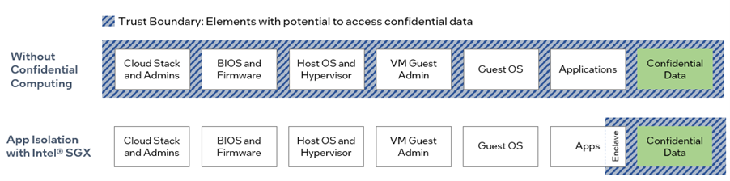
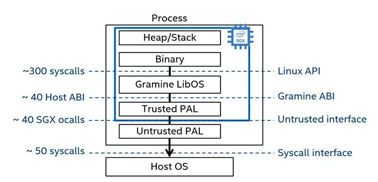
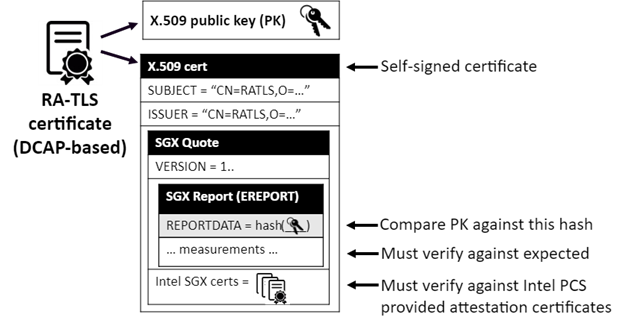

# A Minimal Viable Dataspace with Eclipse Dataspace Components utilizing Intel Software Guard Extensions


## Abstract

A dataspace connector is a key part of any dataspace's infrastructure as it will be the agent to establish organizational identities, connect to dataspace-external data sources and sinks, and host the policy enforcement point for any in-dataspace operation.

Securing such a critical component of a dataspace against external attacks is essential in creating a convincing data-sovereign setup that can be hosted on-prem or in the cloud. 

In this white paper we are going to explain how an EDC deployment based on Confidential Computing principles - runtime encryption and attestation - is possible. We are going to show how Intel's Software Guard Extensions can be utilized to set up a Minimal Viable Dataspace (MVD) without fundamental changes to the code of the business logic. 


## Confidential Computing Basics


### Confidentiality via Runtime Encryption

Encryption is a well-known state-of-the-art control for confidentiality and integrity of data at rest and in transport. Within the life-cycle of data, however, data that is being processed traditionally needs to be in the clear. On shared platforms such as those employed in cloud computing this creates an attack surface within the shared server nodes by potentially exposing secrets to infrastructure software such as hypervisors and their administrators.

Permitting to process such sensitive data in a protected environment within processors, a so-called Trusted Execution Environments (TEE) which applies enryption-at-runtime to memory accesses for instruction and data streams, lies at the heart of the concept of Confidential Computing, a term defined by an industry-wide organization under the auspices of the Confidential Computing Consortium (<https://confidentialcomputing.io>).

Confidential Computing falls under the category of Privacy Enhancing Technologies (PET) which also covers other, more limited technologies such as Homomorphic Encryption (HE) or Trusted Platform Modules (TPMs). A comparison between these technologies can be found in this Confidential Computing Consortium’s white paper in Table 1 on page 6:<https://confidentialcomputing.io/wp-content/uploads/sites/85/2023/01/CCC_outreach_whitepaper_updated_November_2022.pdf>


### Verification by Attestation

While a Trusted Execution Environment can be utilized to protect benign sensitive code and its runtime data, it could theoretically also be abused to hide malicious code from the observing eye. To counteract such a threat and to ensure the integrity of a spawned application and its surrounding TEE, a Confidential Computing platform typically provides business logic to attest both integrity measures against well-known expectations. Such measures may include information such as calculated hashes of the TEE’s memory at a certain point in time, or platform security patch-level information.

Only having both, the TEE together with the attestation capabilities, will then provide sufficient guarantees on confidentiality and integrity of code and data and would thus build the necessary assurances to run trusted code on basically untrusted platforms.


## How Intel SGX implements CC



Intel Corporation is one of the CPU vendors on the market who implements Confidential Computing via a technology called Intel® Software Guard Extensions (SGX). This technology implements a process-focused TEE to create the smallest possible trust boundary around a piece of code by implementing so-called Secure Enclaves. These are encrypted memory regions that act as a TEE for code and data. Fetching data from these regions for code execution transparently decrypts data in the memory controller such that data is only visible in cleartext inside the CPU package. Conversely, data that is written to such a region from code within the region will be encrypted transparently. Special privileged instructions are used to enter these Secure Enclaves by which the corresponding Enclave-owner-specific key is loaded into the memory data path. Key handling is part of the SGX business logic (itself implemented via firmware in Secure Enclaves) and thus hidden even from system software.

SGX was introduced by Intel on client CPUs first. This initial version was limited in its capabilities, with enclave memory only up to several tens of MBytes, and an attestation service based on Enhanced Privacy ID (EPID) to preserve the privacy of the device owner from the attesting party. This version, sometimes unofficially (and probably incorrectly) called SGX1, has by now been discontinued by Intel.

Since the 3rd generation of the Intel Xeon Scalable Processor (formerly known as Icelake), SGX has been launched as a mainstream server technology, featuring enclave space of up to 1 TB, and an in-line full-speed encryption datapath. It also utilizes a scalable attestation scheme based on the ECDSA signature algorithm which allows to build cached datacenter-local attestation services private to a datacenter owner.

A blog post by Anil Rao (Intel) clarified the above and provided an outlook of Intel’s commitment to SGX.

As code within the Enclave has restricted privileges it cannot directly call the operating system on the host. It is thus necessary to relay messages back and forth between the hosting OS and the enclave via appropriate software layers to utilize operating system services and other parts of the hosting application. Here, two main concepts are existing:

1. An SDK gets used on the host to abstract Enclaves and their methods, permitting the application developer to directly program to the Enclave abstraction. The Intel SGX SDK and the Open Enclave SDK are open source kits and the best-known examples of such libraries. The advantage of this direct-to-Enclave approach lies in its control over code size and frequency of performance-impacting context changes between host OS and protected application, keeping the trust boundary as small as possible. This comes at the cost of having to refactor the application.
2. The application to be run inside the Enclave gets linked to a Library OS which essentially emulates the necessary services of an operating system in the process context of the application, and only breaks out of the Enclave to the host OS when absolutely necessary. This concept can be used to basically “lift-and-shift” existing applications with very little effort but comes at the cost of higher memory consumption, a bigger trust boundary, and less control over the frequency of Enclave-to-host context changes, thus less control over the final performance.  
   Examples of such LibraryOSs are Gramine and Occlum (open source) and SCONE, Anjuna, and Fortanix Runtime Encryption (commercial).

Find more information on Intel® SGX at <https://www.intel.com/content/www/us/en/architecture-and-technology/software-guard-extensions.html>.


## How Gramine Helps to Lift-and-Shift

Gramine is a lightweight guest OS, designed to run a single Linux application with minimal host requirements. Gramine can run applications in an isolated environment with benefits comparable to running a complete OS in a virtual machine – including guest customization, ease of porting to different host OSes, and process migration.

Gramine supports running Linux applications using the Intel SGX (Software Guard Extensions) technology (we sometimes call this version Gramine-SGX). SGX protects code and data in the enclave against privileged software attacks and against physical attacks on the hardware outside of the CPU package (e.g., cold-boot attacks on RAM). Gramine is able to run unmodified applications inside SGX enclaves, without the toll of manually porting the application to the SGX environment.

Gramine works by replacing libc during an application build process with its own customized version providing a libc-compatible API to the application within the SGX enclave and a companion layer outside of the enclave to interface with the host OS. See the following diagram to understand the setup.



The configuration of the SGX enclave and its “gramenized” application can be controlled via a manifest file whose description can be found at <https://gramine.readthedocs.io/en/latest/manifest-syntax.html#manifest-syntax>.


### RA-TLS Attestation and its Use

Gramine integrates Intel’s SGX attestation process into the TLS connection setup on sockets connecting to and from the enclave. This variant called_RA-TLS_ is described in more detail in Gramine’s documentation at <https://gramine.readthedocs.io/en/latest/attestation.html#attestation-and-secret-provisioning>.

Conceptually, Gramine extends the standard X.509 certificate with SGX-related information (SGX quote). The additional information allows the remote user (verifier) of the certificate to verify that it is indeed communicating with an SGX enclave (attester). See the following diagram for the extended X.509 certificate:



## GSC as a deployment variant for Gramine

If containers are the deployment variants of choice, Gramine exists as a pre-made Docker image at <https://hub.docker.com/r/gramineproject/gramine> and is documented at <https://gramine.readthedocs.io/en/latest/container-integration.html#gramine-docker-image>.

In addition, GSC (short for:_Gramine Shielded Containers_) provides a toolset to create a Gramine layer that can be used to create a “gramenized” and signed Docker container of an original application (<https://gramine.readthedocs.io/en/latest/container-integration.html#gsc-gramine-shielded-containers>).

This application can then be launched by standard Docker CLI or API, or by any orchestration that utilizes a Docker container runtime (e.g. k8s) to spawn such containers.

GSC’s repository and documentation are separate from the main Gramine documentation and can be found at ``<https://github.com/gramineproject/gsc> and <https://gramine.readthedocs.io/projects/gsc>, respectively.


# Minimal Viable Demonstrator Using Confidential Computing


## Using Stable EDC MVD Versions

The EDC (Eclipse Dataspace Connector) MVD (Minimal Viable Demonstrator) is used to show Eclipse Dataspace Connectors running in ‘Confidential Computing’ mode. For a reproducible setup, care should be taken when selecting the version of EDC and MVD, since both are in ongoing development and improvement.

The Minimal Viable Demonstrator demo requires two prerequisites, the Connector and DataDashboard projects. The versions of these prerequisites need to match the version of the MVD in order for the demo to function properly.

A matching version of Connector available at the time the demo was created was v0.0.1-milestone-7. More precisely, the version recommended to recreate the setup is

```
commit 49ddb9a5940ae8a454e34ad023bfc035a0a05619 (HEAD, tag: v0.0.1-milestone-7)
Author: Julia Pampus &lt;72392527+juliapampus@users.noreply.github.com>
Date: Tue Nov 8 14:13:54 2022 +0100
   chore(build): change groupId to org.eclipse.edc (#2154)
   * chore(build): update groupId
   * chore(build): change metamodel version to 0.0.1-SNAPSHOT
   * chore: update OpenApi files
```


and can be cloned from here <https://github.com/eclipse-edc/Connector/tree/v0.0.1-milestone-7>

A matching version of DataDashboard available at the time the demo was created was

```
commit c010511760311e974253462e619add2fe2bfaa8e (HEAD)
Author: Ronja Quensel &lt;72978761+ronjaquensel@users.noreply.github.com>
Date: Thu Nov 10 10:18:33 2022 +0100
   fix: rename policy definition uid to id (#12)
```


and can be cloned from here <https://github.com/eclipse-edc/DataDashboard/tree/c010511760311e974253462e619add2fe2bfaa8e> .

The version of MVD compatible with the above two versions is

```
commit 59962f0522265efd14570f2ee9f0a42dc8ebda02 (HEAD)
Author: Enrico Risa &lt;enrico.risa@gmail.com>
Date: Fri Nov 25 09:53:04 2022 +0100
refactor: upgrade to edc 0.0.1-milestone-7 (#100)
refactor: rebranding groupdId into org.eclipse.edc and upgrade to edc 0.0.1-milestone-7
```


## Base setup of EDC MVD for Building GSC Images

The standard version of MVD uses a Docker Compose file that both builds and then runs the images of the MVD. In contrast, for the SGX demo we need to build base EDC images, process them for SGX using Gramine Shielded Containers then run the resulting images. This requires a modified copy of the MVD docker compose file from here

<https://github.com/eclipse-edc/MinimumViableDataspace/blob/59962f0522265efd14570f2ee9f0a42dc8ebda02/system-tests/docker-compose.yml>

In the copy, modify the sections for company1 and company2 so the image name is explicitly specified. Here is an example of the update of the Docker Config file to explicitly use image names:

```
company1:
   container_name: company1
   build:
      context: ../launchers/connector
      image: system-tests_company1:latest # new line
   environment:
      JVM_ARGS: "-agentlib:jdwp=transport=dt_socket,server=y,suspend=n,address=\*:5005"
      ...
   
```

To test this, use the original docker-compose.yml file to generate the images

`docker-compose --profile ui -f system-tests/docker-compose.yml build`

Next, use the modified file (e.g. docker-compose-img.yml) to run the demo:

`docker-compose --profile ui -f system-tests/docker-compose-img.yml up`

**Important:** follow all MVD setup steps described (e.g. from <https://github.com/eclipse-edc/MinimumViableDataspace/tree/59962f0522265efd14570f2ee9f0a42dc8ebda02>) for the version referred here before attempting to build and start the MVD.

Once images can be built and run on a development machine, the next step is to try the scenario on an SGX enabled machine. If the SGX enabled machine is not supporting building the MVD but only running it, one may try to build the images on a non-SGX development machine, tag and push the images to an image repository then pull and locally tag the images on the SGX machine.


## Using GSC to Generate EDC MVD Images

To use the confidential computing features of the Intel SGX platform, one needs to run applications in a mode compatible with SGX More details are available in the ‘How Gramine Helps to Lift-and-Shift’ section of this document.

In brief, for running pre-build Docker images, instead of building the application using Gramine, one uses Gramine Shielded Containers to wrap existing images into a Gramine specific layer that provides the SGX functionality when running the images.

There are a few steps required for producing a GSC wrapped image. They assume the following prerequisites:

- The SGX enabled machine is configured. Consult <https://www.intel.com/content/www/us/en/developer/tools/software-guard-extensions/get-started.html> for setting up an SGX enable machine. This demo has been setup using the <https://01.org/intel-softwareguard-extensions/downloads/intel-sgx-linux-2.16-release> version of SGX which can be downloaded from here <https://01.org/intel-software-guard-extensions/downloads>
- Validate the SGX setup by running a HelloWorld Gramine application <https://gramine.readthedocs.io/en/stable/quickstart.html>

If the above are met, GSC enabled images for MVD can be built.

When configuring the test docker-compose-img.yml file in the previous section, it was recommended to try running the image the company1, Repeat the step for company2 as well. This will result in having two local images validated:

```
system-tests_company1:latest
system-tests_company2:latest
```


These two images will be wrapped with GSC as per the instruction available here <https://gramine.readthedocs.io/projects/gsc/en/latest/index.html>

As an example, here are the steps necessary to build the corresponding GSC image for company1:

```
# build the GSC wrapped image
./gsc build --insecure-args $BASE_GSC_IMAGE ./$MANIFEST_FILE.manifest
# cleanup previous runs
rm -rf ~/.config/gramine
mkdir -p ~/.config/gramine
# generate an enclave key
openssl genrsa -3 -out ~/.config/gramine/enclave-key.pem 3072
# sign the GSC wrapped image
./gsc sign-image $BASE_GSC_IMAGE ~/.config/gramine/enclave-key.pem
# validate the GSC processing of the base image
./gsc info-image gsc-$BASE_GSC_IMAGE
```

where

`$BASE_GSC_IMAGE` is `system-tests_company1:latest`

and

`$MANIFEST_FILE` is described below.

The manifest file referred above instructs GSC in setting up the GSC wrapped image. The information tells GSC about the specifics to be taken into account when running the base image.

Here is an annotated version of the configuration that was used to run EDC MVD in GSC mode:
```
# consult https://gramine.readthedocs.io/en/stable/manifest-syntax.html for more details on options below
# controls the enclave size
# adjust this to allow the application to run
sgx.enclave_size = "1024M"
# controls the maximum number of threads
# currently set to the maximum value
# this can be adjusted to a lower value if needed
sgx.thread_num = 1024
# allows support for non-relocatable binaries
sgx.nonpie_binary = true
# controls which files are trusted by Gramine
# currently configured to the entire set of files that come with the connector
# this can be trimmed down if needed
sgx.allowed_files = [
   "file:/resources/appconfig/company1/app.config.json",
   "file:/resources/appconfig/company2/app.config.json",
   "file:/resources/cli-tools/Dockerfile",
   "file:/resources/cli-tools/",
   "file:/resources/cli-tools/entrypoint.sh",
   "file:/resources/cli-tools/identity-hub-cli.jar",
   "file:/resources/cli-tools/registration-service-cli.jar",
   "file:/resources/cli-tools/validate.onboarding.sh",
   "file:/resources/self-description/company1/sdd.json",
   "file:/resources/self-description/company2/sdd.json",
   "file:/resources/vault/company1/company1-vault.properties",
   "file:/resources/vault/company1/cert.pem",
   "file:/resources/vault/company1/company1-keystore.jks",
   "file:/resources/vault/company1/company1-vault.properties",
   "file:/resources/vault/company1/private-key.pem",
   "file:/resources/vault/company1/public-key.pem",
   "file:/resources/vault/company2/company2-vault.properties",
   "file:/resources/vault/company2/cert.pem",
   "file:/resources/vault/company2/company2-keystore.jks",
   "file:/resources/vault/company2/company2-vault.properties",
   "file:/resources/vault/company2/private-key.pem",
   "file:/resources/vault/company2/public-key.pem",
   "file:/resources/vault/gaia-x/private-key.pem",
   "file:/resources/vault/gaia-x/public-key.pem",
   "file:/resources/vault/registration-service/private-key.pem",
   "file:/resources/vault/registration-service/registration-service-keystore.jks",
   "file:/resources/vault/registration-service/registration-service-vault.properties",
   "file:/resources/webdid/company1/did.json",
   "file:/resources/webdid/company2/did.json",
   "file:/resources/webdid/gaia-x/did.json",
   "file:/resources/webdid/registration-service/did.json"
]

# specifies the path to temporary files location
fs.mounts = [
      { type = "tmpfs", path = "/tmp" },
]

# allows passing in environment variables from the running environment
# for better security, specify exactly which environment variables are accepted, see
loader.insecure__use_host_env = true

# allow system calls eventfd() and eventfd2()
# for better security, consider investigating alternative mechanisms in the EDC MVD
sys.insecure__allow_eventfd = true
```


## Running GSC EDC MVD Images

Generating the GSC enabled images produces images following a certain naming pattern. For example, for

`system-tests_company1:latest` as input image name, Gramine generates an image named `gsc-system-tests_company1:latest`. 

  
The image name needs to be configured in `docker-config.yml` for running the ‘Graminized’ image.

In addition, the Docker configuration to have info about the enclave:

```
volumes:

   - ./resources:/resources
   - /var/run/aesmd/aesm.socket:/var/run/aesmd/aesm.socket**
```


This is the base configuration needed to run SGX enabled EDC connectors in MVD. Read the next section for more information on making this setup work, if necessary.


## Tips and Tricks

The base setup for running Java EDC on SGX is described in the previous section. Nevertheless, depending on the environment, a few more steps or configurations are needed for the entire image signing, running flow to work.


### Python Hack

Somehow, the libcrypto library is not found during Gramine run. Until this is properly figured out, here is how to work around the problem.

In /usr/lib/python3.8/ctypes/util.py around line 342 in the else section that implements the find_library function, just before the return statement, insert this snippet:

```
if foundLibrary is None:
   if name == "crypto":
      foundLibrary = "libcrypto.so.1.1"
return foundLibrary
```


This code, however, needs to run when the base image is signed by GSC. Therefore, the file needs to be copied inside the container. This requires building an intermediary image before signing. To do this, create a gsc-company1.dockerfile like

```
From system-tests_company1:latest

COPY /usr/lib/python3.8/ctypes/util.py /usr/lib/python3.8/ctypes/util.py
```

Build an image using this Docker file

`sudo docker build --tag company1-sgx-base --no-cache --network=host --file ./gsc-company1.dockerfile .`

and use the new image name when signing the image. This will result in a

`gsc-company1-base-image:latest`

image being generated. This new name should therefore be used in the `docker-config-gsc.yml` that starts the EDC MVD.


### Networking Hack

If running the demo within a enterprise environment which uses local dns resolvers, it may happen that the GSC image building fails due to not resolving external repos from where apt packages are pulled.

This may be worked around by creating a suitable resolv.conf file and copying it into the image as part of the dockerfile steps:

```
COPY resolv.conf /etc/resolv.conf
```

The content of resolv.conf highly depends on the local environment so it won’t be provided here. Essentially, one needs to figure out how to make external repos resolve when the GSC image is built.


### Gramine Hack

One may discover that having the external repo hostnames resolved is not enough for the GSC image to build. It is also necessary for the repos to be accessible. Depending on the Docker setup, one may need to run the image build process in the network of the host. Apparently this option is not provided or it has not been found but it can be worked around.

When cloning the <https://github.com/gramineproject/gsc.git>, check out the v1.3.1 branch and patch the gsc/gsc.py file by inserting

`network_mode=\"host\",`

at line 43. This should allow GSC setup to run in the host network.


### Java EDC MVD Compatibility with Gramine

When starting the Graminized containers, one may discover the Java process does not work properly., To work around various limitations or peculiarities of the setup, use the following JAVA_ARGS in docker-config:

```
JVM_ARGS: 
"-agentlib:jdwp=transport=dt_socket,server=y,suspend=n,address=\*:5005 
-Xms680m -Xmx680m -XX:MaxMetaspaceSize=175m 
-Djava.net.preferIPv4Stack=true -XX:-UseCompressedClassPointers 
-Dos.name=win"
```

If interested, one may remove the last three options one-by-one to see what error comes back and then read about it in more detail.


### Networking Between Running Containers

With the networking work-arounds described above, one may discover Graminised containers fail starting due to not being able to access containers.

One sure way to ensure connectivity is to force each container on a particular IP within the Docker network it runs and provide this information to the Java process. For this, create a javahosts file as below

```
172.19.0.2 did-server
172.19.0.3 azurite
172.19.0.4 registration-service
172.19.0.5 company1
172.19.0.6 company2
172.19.0.7 company3
172.19.0.8 newman
172.19.0.9 cli-tools
172.19.0.10 company1-datadashboard
172.19.0.11 company2-datadashboard
172.19.0.12 company3-datadashboard
```

and add it to the JVM_ARGS configuration:

```
JVM_ARGS: 
"-agentlib:jdwp=transport=dt_socket,server=y,suspend=n,address=\*:5005 
-Xms680m -Xmx680m**-Djdk.net.hosts.file=/etc/javahosts** -XX:MaxMetaspaceSize=175m 
-Djava.net.preferIPv4Stack=true 
-XX:-UseCompressedClassPointers -Dos.name=win"
```

For the file to be available, it also needs to be copied into the Graminzed image so the dockerfile needs to be updated as well:

`COPY javahosts /etc/javahosts`

Finally, the docker-compose file needs to be updated so each container runs on it allocated IP on the MVD Docker network. For example, for company1, add

```
hostname: company1
   networks:
      mvd:
         ipv4_address: 172.19.0.5
```


to its specific docker-compose section. Repeat this for all containers, with their specific IPs.

Also add network configuration to the docker-compose file:

```
networks:
   mvd:
      driver: bridge
      ipam:
         config:
         - subnet: 172.18.0.0/16
           gateway: 172.18.0.1
```


Applying the above workaround and hacks should suffice for being able to start the EDC MVD with company1 and company2 running in SGX mode. One may confirm this by grepping the logs for a “Gramine is starting” message.


## Accessing Running GSC EDC MVD Images

The EDC MVD required interactions with the Azurite Storage Explorer and the web frontends of the connectors. The latter requires a browser for interacting with the connectors. The the base EDC MVD scenario, both the Azurite Storage Explorer and the browser accessing the web frontends of the connectors run on the same host as the EDC MVD.

The above setup may not be feasible in the case of an SGX machine which expose only a console interface. To workaround this, one may try to use a local X server and export the UI output from the host machine into the local X server. This setup may not be very convenient so alternately, one may setup ssh tunnels from the local machine into the SGX host.

Here is a quick setup to expose all EDC MVD ports on the local machine,

```
# StorageExplorer
ssh -o ExitOnForwardFailure=yes -L 10000:$RH:10000 $LOGIN -fN
ssh -o ExitOnForwardFailure=yes -L 10001:$RH:10001 $LOGIN -fN
ssh -o ExitOnForwardFailure=yes -L 10002:$RH:10002 $LOGIN -fN

# company1
ssh -o ExitOnForwardFailure=yes -L 7080:$RH:7080 $LOGIN -fN
ssh -o ExitOnForwardFailure=yes -L 9191:$RH:9191 $LOGIN -fN
ssh -o ExitOnForwardFailure=yes -L 8181:$RH:8181 $LOGIN -fN
ssh -o ExitOnForwardFailure=yes -L 5005:$RH:5005 $LOGIN -fN
ssh -o ExitOnForwardFailure=yes -L 7171:$RH:7171 $LOGIN -fN

# company2
ssh -o ExitOnForwardFailure=yes -L 7081:$RH:7081 $LOGIN -fN
ssh -o ExitOnForwardFailure=yes -L 9192:$RH:9192 $LOGIN -fN
ssh -o ExitOnForwardFailure=yes -L 8182:$RH:8182 $LOGIN -fN
ssh -o ExitOnForwardFailure=yes -L 5006:$RH:5006 $LOGIN -fN
ssh -o ExitOnForwardFailure=yes -L 7172:$RH:7172 $LOGIN -fN

# company3
ssh -o ExitOnForwardFailure=yes -L 7082:$RH:7082 $LOGIN -fN
ssh -o ExitOnForwardFailure=yes -L 9193:$RH:9193 $LOGIN -fN
ssh -o ExitOnForwardFailure=yes -L 8183:$RH:8183 $LOGIN -fN
ssh -o ExitOnForwardFailure=yes -L 5007:$RH:5007 $LOGIN -fN
ssh -o ExitOnForwardFailure=yes -L 7173:$RH:7173 $LOGIN -fN

# registration-service
ssh -o ExitOnForwardFailure=yes -L 9194:$RH:8184 $LOGIN -fN
ssh -o ExitOnForwardFailure=yes -L 8185:$RH:8185 $LOGIN -fN
ssh -o ExitOnForwardFailure=yes -L 5008:$RH:5008 $LOGIN -fN
ssh -o ExitOnForwardFailure=yes -L 7174:$RH:7174 $LOGIN -fN
```

Where %RH is the hostname or IP of the SGX remote host and $LOGIN is username@host, if login via ssl certificates is supported by the SGX host.

With the above setup, one may use the Azurite Storage Explorer needed for the MVD setup steps by pointing it to the local 10000, 10001 and 10002 ports.

Similarly, one may access the MVD connector frontends by pointing the browser to the local 7080, 7081 and 7082 ports.


## Brief Overview of the EDC MVD Demonstration

To view the demo in action, access <https://www.youtube.com/watch?v=c9vtlT7OCPs&authuser=0> . It is setup based on the information described above.


# Summary and Outlook

In the interest of expediency and confirming basic functionality.,the EDC MVD SGX setup uses various workarounds and hacks to make the MVD run on SGX. It would be an interesting exercise to find better ways to approach the setup to reach a simpler setup. If necessary, the workarounds and hacks may be transformed into proper patches into their corresponding code, for the issues being addressed.

As far as the EDC MVD itself, it may be beneficial if the MVD and DataDashboard had specific tags associated with the EDC releases. This should trying using more recent versions of the MVD that are stable and do not depend on the EDC latest committed changes.

### CREDITS
This article was written by [Markus Leberecht](https://www.linkedin.com/in/dr-markus-leberecht-7b4374) of [Intel Corporation](https://www.intel.com) and [Sergiu Stejar](https://www.linkedin.com/in/sstejar/) of [IONOS SE](https://www.ionos.com). 

Markus Leberecht is a Solution Architect interested in security solutions and their hardware support. 

Sergiu Stejar is a Software Architect at IONOS Cloud. 
