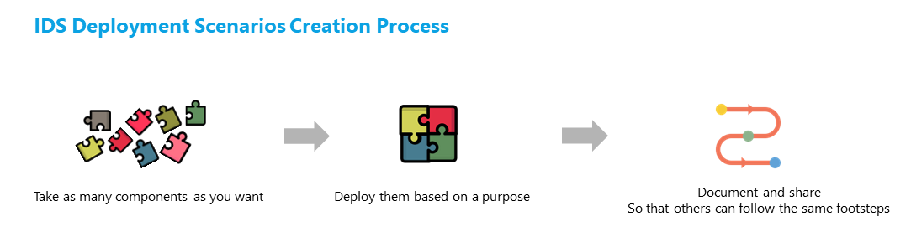

# IDS Deployment Scenarios
This repository lists IDS Deployment Scenarios from various domains and cases. It serves as a library of information, listing different deployment alternatives applied by IDS projects. The ultimate aim is to create a source of inspiration and guidance for those who wish to experiment with data spaces or search for the best deployment practices. This repository also serves as a platform where everyone can express their opinions on the existing deployment scenarios by creating issues and initiating discussions around them.

## List of Existing IDS Deployment Scenarios

| Name of the Deployment Scenario | Provider | Description | Used Components | 
| -------- | -------- | -------- | -------- |
| [Minimum Viable Data Space](Deployment-Scenarios/minimum-viable-data-space-top-ix.md) | [TOP-IX](https://www.top-ix.org/it/home/) | An example deployment of Minimum Viable Data Space (as defined by IDSA) | CA, DAPS and Connector |
| [IDS Testbed Deployment Using Kubernetes Architecture](Deployment-Scenarios/minimum-viable-data-space-using-k8s.md) | [ATOS](https://atos.net/es/spain) | How to deploy an IDS-Testbed using Kubernetes | CA, DAPS and Connector |

:rocket: [Minimum Viable Data Space](https://github.com/International-Data-Spaces-Association/IDS-testbed/blob/master/minimum-viable-data-space/MVDS.md) is also included as a deployment scenario, defined by IDSA Head Office. It is also a great place to start creating a deployment scenario.

## What is an IDS Deployment Scenario? 
An IDS deployment scenario is a description of the steps and processes involved in delivering a component or a set of components to end-users. It outlines the various stages of deployment, from development and testing to release and optionally maintenance. The scenario typically includes information on the prerequisites (such as hardware and software requirements), configuration settings, and any necessary third-party integrations. It also includes details on the deployment environment, such as whether it will be installed on-premises or in the cloud, and how the system will be monitored and supported once it is live. A deployment scenario helps ensure that the deployment process is consistent, easily repeatable, reusable and efficient, and that the system is deployed in a way that meets the needs of end-users. 

A deployment scenario can be considered as any implementation made with IDS-compliant components:
- that allows sovereign data sharing (as defined by IDSA)
- is built with a clear purpose, to solve a problem
- is adequately documented to enable others to follow the same path

### Example: 

As depicted on the image above, there are several ways to create a deployment scenario. As long as the implementation is made for a purpose and contains an IDS-compliant component, it can be considered as an IDS Deployment Scenario. 

An envisaged flow for running an experiment with a IDS Deployment Scenario can be considered as depicted on the image below:

### The Importance of Sharing Deployment Scenarios
We are currently in the early stages of data spaces technology. Although the concept has been around for a few years, it is possible to say that it is still relatively new and underdeveloped. Data spaces offer a range of benefits, including improved collaboration, increased efficiency, and better decision-making. However, the technology is still evolving, and there are many challenges that need to be addressed, such as data privacy and security concerns, interoperability issues, and the need for standardized protocols. As a result, data spaces are still in the early-adoption phase, with only a minority exploring the technology's potential, and on the other hand, a vast majority looking for best practices.

In all technologies in this early-adoption phase, sharing experiments and deployment scenarios play a crucial role in the technology's evolution. The sharing of best practices and deployment scenarios is particularly important in the case of data spaces, as it is a complex and evolving technology. Sharing deployment scenarios can help others learn from your experiences and avoid common mistakes. It can also facilitate the creation of standards and best practices, which can help drive the adoption and development of data spaces. By sharing their experiences and best practices, early adopters can help build a strong and collaborative community of data space practitioners, which will be critical to the success of this emerging technology.

### Why Should I Share My Deployment Scenario with Others?  
Sharing your deployment scenario with others is an essential part of the open source philosophy, which is based on the idea that collaboration and sharing knowledge leads to better results. By sharing your deployment scenario, you allow others to learn from your experience and benefit from your insights, potentially saving them time and effort in their own deployment process.

Sharing deployment scenarios with others can also have many advantages for the original implementor, including:

- **Getting recognized**: Sharing deployment scenarios with others can help the original implementor get recognized for their work. By sharing their scenarios, they can showcase their expertise and demonstrate their ability to solve complex problems.

- **Feedback and improvement**: When others use the deployment scenarios, they may provide feedback and suggest improvements. This can help the original implementor refine their work and make it even better.

- **Collaboration**: Sharing deployment scenarios with others can foster collaboration and create a community of people who are interested in similar topics. This can lead to new partnerships, joint projects, and opportunities to learn from others.

- **Feel good factor**: Sharing deployment scenarios with others can give the original implementor a sense of satisfaction and fulfillment. Knowing that their work is helping others and making a positive impact can be very rewarding.

### Relationship with Data Space Radar
In the [Data Space Radar](https://internationaldataspaces.org/adopt/data-space-radar/), all solutions that reached the pilot and live stages can be considered as an IDS Deployment Scenario, since they involve the implementation of a data space solution to solve a specific business problem. 

### How to assess the maturity level of a IDS Deployment Scenario?
The maturity level of an IDS Deployment Scenario is currently not listed but as more IDS deployment scenarios are listed, we will have this activated. 

Meanwhile, please feel free to check and comment on the [Maturity Assessment Criteria](Maturity-Assessment-Criteria.md) on this repository that suggests a methodology to assess the maturity of IDS Deployment Scenarios, in three levels: Sandbox, Incubated and Graduated. 

## How can I share a deployment scenario?
You are warmly invited to contribute to the IDS Deployment Scenarios in two ways: 

:triangular_flag_on_post: By sending a pull request via this repository (please be sure to check the [contribution guidelines](CONTRIBUTING.md)).

:triangular_flag_on_post: You can also share it [via this form](https://forms.office.com/Pages/ResponsePage.aspx?id=NNZGs_usx0K9RPFVfuibG3WVHeFvj2hHgjU7ZCgshUhUMExMOTdCWDNMSERJTjlIUlRKMVc0QTUxMCQlQCN0PWcu) for [the Data Space Radar](https://internationaldataspaces.org/adopt/data-space-radar/). While filling in the form, please note that only the implementations at the pilot and live stages will be considered as IDS Deployment Scenarios.

## Is there a template I should follow? 
While there is no strict template to adhere to when sharing deployment scenarios with others, we have some recommendations that can be taken into consideration to ensure that the sharing process is effective and helpful. 

We recommend that your deployment scenario to contain: 
- **System Requirements**: Specify the minimum hardware and software requirements necessary for the successful deployment of the system.
- If any **network configuration** is required.
- **Deployment diagram** (to show which environment each component is deployed) Docker, Kubernetes Server, etc. Describe the overall architecture of the system, including any third-party components or integrations.
- Which **components** are used in the deployment scenario. 
- What **purpose** the entire deployment is made for? What problem it tries to solve? Please clearly define the **purpose of the deployment scenario**, including the intended use case and expected outcomes.
- **Deployment Process** Describe the deployment process, including any installation, configuration, or testing procedures.
- Any **other resources** that might be helpful for a third party to reproduce the scenario.
