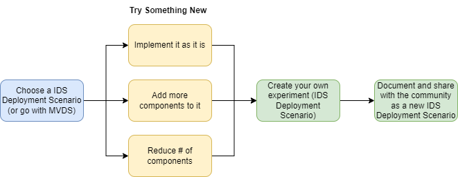

# IDS-Deployment-Scenarios
This is the repository where IDS Deployment Scenarios from various domains and cases are listed. It acts as a library of information listing different deployment alternatives applied by IDS projects. The ultimate aim is to create a source of inspiration and guidance for others who would like to experiment with data spaces or are simply in search for best deployment practices. This is also expected to act as a place where everyone can express their opinions on the existing deployment scenarios by creating issues and initiating discussions around them.

:rocket: [Minimum Viable Data Space](https://github.com/International-Data-Spaces-Association/idsa/tree/main/MVDS) is also included as a deployment scenario, defined by IDSA Head Office. It is also a great place to start creating a deployment scenario.

## What is a IDS Deployment Scenario? 
A deployment scenario can be considered as any implementation made with IDS-compliant components:
- that allows sovereign data sharing (as defined by IDSA)
- is built with the intention to resolve a problem, by means of secure and sovereign data sharing
- is adequately documented to enable others to follow the same path

An envisaged flow for running an experiment with a IDS Deployment Scenario can be considered as depicted on the image below:

## List of Existing IDS Deployment Scenarios

| Name of the Deployment Scenario | Provider | Description | 
| -------- | -------- | -------- |
| [Minimum Viable Data Space](Deployment-Scenarios/minimum-viable-data-space-top-ix.md)  | [TOP-IX](https://www.top-ix.org/it/home/)   | An example deployment of [Minimum Viable Data Space](https://github.com/International-Data-Spaces-Association/IDS-testbed/tree/IDS-testbed-mvds/minimum-viable-data-space) (as defined by IDSA) with the use of [CA](https://github.com/International-Data-Spaces-Association/IDS-Deployment-Scenarios/blob/main/Deployment-Scenarios/minimum-viable-data-space-top-ix.md#ca--certificate-authority), [DAPS](https://github.com/International-Data-Spaces-Association/IDS-Deployment-Scenarios/blob/main/Deployment-Scenarios/minimum-viable-data-space-top-ix.md#daps--dynamic-attribute-provisioning-service) and [Connector](https://github.com/International-Data-Spaces-Association/IDS-Deployment-Scenarios/blob/main/Deployment-Scenarios/minimum-viable-data-space-top-ix.md#connector) |

## How to contribute with (or to) a deployment scenario?
You are warmly invited to contribute to the IDS Deployment Scenarios in two ways: 

:triangular_flag_on_post: Either by suggesting to list a deployment scenario here by using [the Data Space Radar form](https://forms.office.com/Pages/ResponsePage.aspx?id=NNZGs_usx0K9RPFVfuibG3WVHeFvj2hHgjU7ZCgshUhUMExMOTdCWDNMSERJTjlIUlRKMVc0QTUxMCQlQCN0PWcu). 

:bulb: Or by expressing your idea, suggest something new (or asking a question) on a specific deployment scenario by creating an issue, by checking the contribution rules on [CONTRIBUTING.md](CONTRIBUTING.md), and the [Code of Conduct](CODE_OF_CONDUCT.md).

